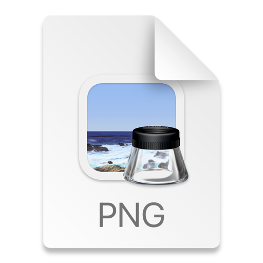

# タスクトラッカー
自分の日々のタスクを把握し、後から日々の頑張りを見すことのできるアプリ

[App Store](https://apps.apple.com/jp/app/%E3%82%BF%E3%82%B9%E3%82%AF%E3%83%88%E3%83%A9%E3%83%83%E3%82%AB%E3%83%BC/id6447428420)
[Google Play](https://play.google.com/store/apps/details?id=com.domain.firebase_crud)

## スクリーンショット(iPhone14Pro)

| 技術 | 用途 |
| --- | --- |
| Flutter3.7.8 | iOS、Android開発で使用 |
| Dart2.19.5 | Flutterのロジック開発で使用 |
| RIverpod2.0 | 状態管理で使用 |
| Firestore | データの保存 |
| flutter_heatmap_calendar | ヒートマップ |
| package_info_plus | 端末情報取得 |
| version | versionの取得 |
| firebase_messaging | 通知 |
| FirebaseAuth | 認証 |
| url_lancher | 強制アップデート先の表示 |

# アプリの機能
匿名ログイン
サインアウト
アカウント削除
タスクの登録
タスクの編集
タスクの削除
ヒートマップ
カレンダー

